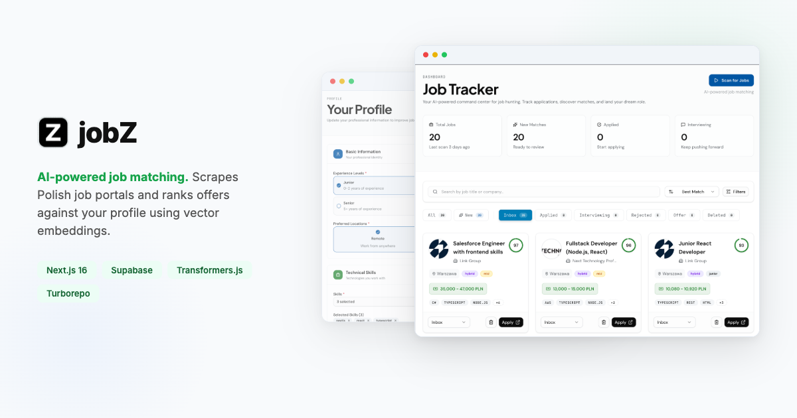

# jobZ — Fullstack AI-Powered Job Matching

> Got tired of manually browsing job offers across multiple boards. Built a fullstack platform that scrapes Polish job portals and ranks offers against my profile using vector embeddings and AI re-ranking.

**[Live Demo](https://jobzzz.jnalewajk.me)**



## What it does

1. **You create a profile** — skills, experience level, career preferences (takes ~2 min)
2. **AI scrapes job boards** — pulls listings from JustJoin.IT and NoFluffJobs in real-time
3. **Offers are ranked by match score** — two-stage AI pipeline scores every listing against your profile
4. **You review a curated feed** — save, archive, or apply to the best matches

## Architecture

```
apps/
└── web/              # Next.js 16 (React 19, App Router) — frontend + server actions

packages/
├── database/         # Supabase client, queries, generated types
├── embeddings/       # AI matching — bi-encoder embeddings + cross-encoder re-ranking
├── scraper/          # Core scraping engine (strategy pattern per job board)
├── ui/               # Shared component library (shadcn/ui + Radix)
└── typescript-config/ # Shared TypeScript presets
```

### AI Matching Pipeline

The matching system uses a **two-stage retrieval** approach:

1. **Bi-encoder** (Transformers.js) — generates vector embeddings for offers and user profiles, then retrieves top ~50 candidates via cosine similarity in Supabase
2. **Cross-encoder** (Transformers.js) — re-ranks candidates by scoring each (profile, offer) pair for precise relevance, returning the top 20 matches with percentage scores

All inference runs in TypeScript via Transformers.js — no external AI APIs required.

### Scraping Engine

Built on the **strategy pattern** — each job board is a pluggable strategy implementing a shared interface:

- **JustJoin.IT** — cursor-based pagination, 100 items/page, technology category filtering
- **NoFluffJobs** — page-based pagination, POST search API, skill-based filtering

Adding a new job board = implementing one strategy class + registering it in the factory.

## Key technical decisions

- **Supabase (PostgreSQL) with Row Level Security** — designed the schema with RLS policies for multi-user data isolation, vector similarity search via `pgvector` for embedding retrieval
- **Two-stage AI pipeline in TypeScript** — bi-encoder for fast candidate retrieval (~50 results via cosine similarity), cross-encoder for precise re-ranking. All inference runs locally via Transformers.js — no external AI APIs or costs
- **Strategy pattern for scraping** — each job board is a pluggable strategy implementing a shared interface. Adding a new portal = one class + factory registration
- **Turborepo monorepo** — separate packages for database, embeddings, scraper, and UI. Strict dependency boundaries, shared TypeScript config
- **Self-hosted on Hetzner VPS** — Docker deployment via Dokploy

## Tech Stack

| Layer | Technology |
|-------|-----------|
| Framework | Next.js 16 (App Router, Server Actions) |
| Language | TypeScript (strict) |
| UI | React 19, Tailwind CSS, shadcn/ui (Radix) |
| Database | Supabase (PostgreSQL), Row Level Security, pgvector |
| AI/ML | Transformers.js (bi-encoder + cross-encoder) |
| Monorepo | Turborepo, pnpm workspaces |
| Validation | Zod (forms, API responses, scraper data) |
| Quality | Biome (lint/format), Husky (git hooks), Knip (dead code) |
| Infrastructure | Docker, Hetzner VPS + Dokploy |

## Getting Started

```bash
# Install dependencies
pnpm install

# Set up environment variables
cp apps/web/.env.example apps/web/.env.local
# Fill in Supabase credentials (URL, anon key, service key)

# Start development
pnpm run dev
```

The web app runs on [http://localhost:3001](http://localhost:3001).

## Author

**Jakub Nalewajk** — Fullstack Developer

- Portfolio: [jnalewajk.me](https://jnalewajk.me)
- GitHub: [@jaqubowsky](https://github.com/jaqubowsky)
- LinkedIn: [jakub-nalewajk](https://www.linkedin.com/in/jakub-nalewajk/)
